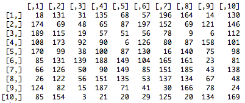

# Matrices


  So far we have worked in only one dimension. Matrices are tables with two dimensions: It contains rows and columns:




**IMPORTANT**: Matrices can contain only **one** type of element: numeric or character (you will see the boolean later.. oops, a new word here :). All lines should have the same number of elements!

Below is how to create matrices:


```
> ## Creation of a matrix mat
> mat <- matrix(nrow=2, ncol=3)
> mat
> ## Creation of the matrix mat with values
> mat <- matrix(data=1:6, nrow=2, ncol=3, byrow=T)
> mat
```

**Remark:** 'matrix' is the second function that we see. 'data', 'nrow' and 'ncol' are called the **parameters** of the function.

<br><br>

**Exercise 5**:

  + Create 4 vectors 'gene1', 'gene2', 'gene3', 'gene4' each containing 3 numeric values of expression
  + Combine the vectors with 'c' and create a matrix 'matrix1' with each line containing a gene
  + Define the row names of matrix1 with the function 'rownames' and the column names with the function 'colnames'

<br><br>

BAM! You have a matrix of gene expression in different conditions! Now is how to access and modify it:


```
> ## Access the expression value of gene2 in the third conditon (second row, 
> ## third column)
> matrix1[2,3]
> ## Modify the expression value of gene 3 in the second condition
> matrix1[3,2] <- 154
> matrix1
> ## You can also access the expression value using names!
> matrix1["gene3", "condition1"]
```

Powerful isn't it? Almost ready to perform your differential expression analysis!

<br><br>

**Exercise 6**:

  + Access the values of gene 1 and 2 in the third condition using row and column names
  + Do the same thing using numbers


