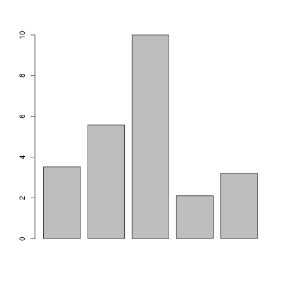
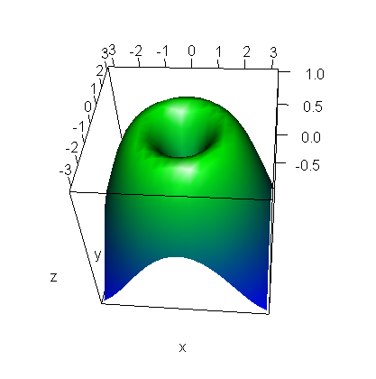

# What is R and what can I do with it?

The programming language R is well known for statistics. R was developed in the 90's at Bell Laboratories (formerly AT&T, now Lucent Technologies) by John Chambers and colleagues. It is based on the S programming language (S for Statistics, yes they were very creative). 
   More than a programming language for statistics, R enables to manipulate data and to perform very powerful graphical representations. It is widely used and benefits from a large community that provides updates and new 'programs'. 

  **IMPORTANT**: In R, we do not speak about 'program' but about '**package**' or '**library**' 

  Widely used in academia, biologists and bioinformaticians quickly developed a community of users who shared their packages. An example is [Bioconductor](https://www.bioconductor.org/packages/release/BiocViews.html#___Software) that provides around 1,500 packages to the bioinformatics community.
  
  Let's now take a simple example of a typical use of R. When performing a RT-PCR, you have a serie of values to represent with a barplot. Below is how to do it with R:
  
```
> pcr_values <- c(3.52, 5.58, 10, 2.1, 3.2)
> barplot(pcr_values)  
```




It is simple as this! You can also obtain some very fancy plots:




  In summary, R enables you to process, organize, analyze and represents your biological data in a powerful manner. But to start playing with your data, you need to learn the basics. In the next section, we are going to see how to use R at EMBL and begin to play with the command line.
  
